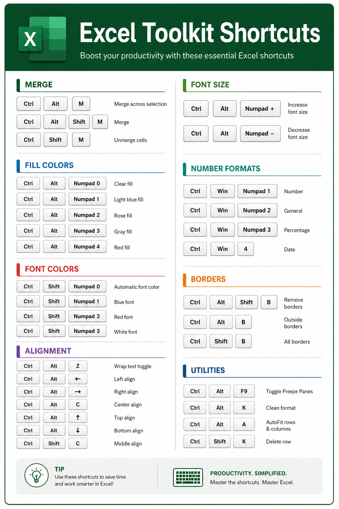

# Excel Toolkit Shortcuts

|Key|Action|
|---|---|
|Ctrl + Alt + M|Merge across selection|
|Ctrl + Alt + Shift + M|Merge|
|Ctrl + Shift + M|Unmerge cells|
|Ctrl + Alt + Numpad0|Clear fill|
|Ctrl + Alt + Numpad1|Light blue fill|
|Ctrl + Alt + Numpad2|Rose fill|
|Ctrl + Alt + Numpad3|Gray fill|
|Ctrl + Alt + Numpad4|Red fill|
|Ctrl + Shift + Numpad0|Automatic font color|
|Ctrl + Shift + Numpad1|Blue font|
|Ctrl + Shift + Numpad2|Red font|
|Ctrl + Shift + Numpad3|White font|
|Ctrl + Alt + Z|Wrap text toggle|
|Ctrl + Alt + Left|Left align|
|Ctrl + Alt + Right|Right align|
|Ctrl + Alt + C|Center align|
|Ctrl + Alt + Up|Top align|
|Ctrl + Alt + Down|Down align|
|Ctrl + Shift + C|Middle align|
|Ctrl + Alt + NumpadAdd|Increase font size by 1|
|Ctrl + Alt + NumpadSub|Decrease font size by 1|
|Ctrl + Win + Numpad1|Set Number Format|
|Ctrl + Win + Numpad2|General format|
|Ctrl + Win + Numpad3|Percentage format|
|Ctrl + Win + 4|Date format|
|Ctrl + Alt + Shift + B|Remove borders|
|Ctrl + Alt + B|Outside borders|
|Ctrl + Shift + B|All borders|
|Ctrl + Alt + F9|Toggle freeze panes at active cell|
|Ctrl + Alt + K|Clean format (remove fill, bold, wrap, reset font)|
|Ctrl + Alt + A|AutoFit columns and rows for selection|
|Ctrl + Shift + K|Delete row|
